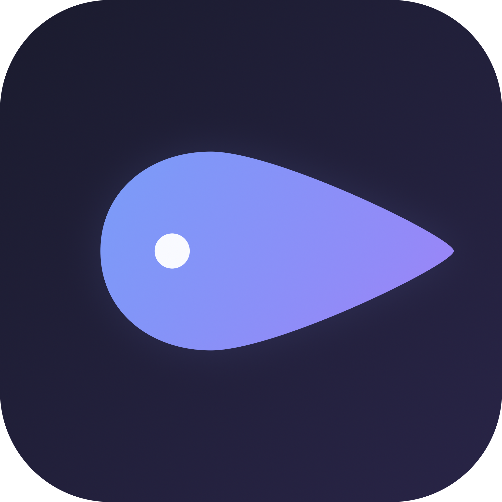

<p align="center">
  
</p>

<h1 align="center">Blobby</h1>

<p align="center">
  一个 macOS 菜单栏小工具，在光标周围画一个动态气泡。
</p>

<p align="center">
  <a href="README.md">English</a>
</p>

<p align="center">
  
  
  
</p>

---

Blobby 会添加一个跟随 macOS 真实光标的气泡覆层。它不会隐藏或替换系统光标。当当前应用隐藏系统光标时，比如全屏视频或文本输入，气泡也会隐藏。

## 功能

- 跟随系统光标的动态气泡覆层
- 保留原生光标
- 应用隐藏真实光标时，气泡也会隐藏
- 三种弹簧模式：Normal、Slow、Bouncy
- 根据移动速度拉伸气泡
- 鼠标按下时有压缩动画
- 可选精确圆点
- 支持多显示器
- 菜单栏设置
- GitHub Releases 更新检查

## 安装

### Homebrew

```bash
brew install --cask --no-quarantine dxsun97/tap/blobby
```

更新：

```bash
brew upgrade blobby
```

### 手动安装

1. 从 [Releases](../../releases/latest) 下载最新版 DMG。
2. 把 **Blobby.app** 拖到 **Applications**。
3. 打开 Blobby，并授予辅助功能权限。

如果 macOS 首次启动时拦截应用，右键 **Blobby.app**，选择 **打开**。

## 权限

Blobby 需要辅助功能权限来读取全局光标位置和鼠标按键状态。

它不会点击、输入、读取窗口内容或收集数据。

授权位置：

**系统设置 > 隐私与安全性 > 辅助功能**

## 使用

点击菜单栏图标打开设置。

| 设置 | 默认值 | 说明 |
|------|--------|------|
| Color | 浅灰色 | 气泡颜色 |
| Size | 40 px | 气泡直径 |
| Opacity | 50% | 气泡透明度 |
| Spring | Normal | 跟随手感 |
| Dot cursor | 关闭 | 在真实光标位置显示圆点 |
| Dot color | 白色 | 圆点颜色 |
| Dot size | 8 px | 圆点直径 |

设置会立即生效，并自动保存。

## 构建

要求：

- macOS 14+
- Xcode Command Line Tools

```bash
git clone https://github.com/dxsun97/Blobby.git
cd Blobby
bash bundle.sh
open .build/Blobby.app
```

构建 DMG：

```bash
bash create-dmg.sh
open Blobby-*.dmg
```

## 开发版

本地测试时，建议用单独的 bundle id，避免开发版和已安装版本共用 macOS 辅助功能权限：

```bash
BLOBBY_DISPLAY_NAME="Blobby Dev" \
BLOBBY_BUNDLE_ID="com.blobby.dev" \
BLOBBY_CODE_SIGN_IDENTITY="Blobby Dev Code Signing" \
bash bundle.sh

open ".build/Blobby Dev.app"
```

`BLOBBY_CODE_SIGN_IDENTITY` 可以省略。省略时会使用 ad-hoc 签名。频繁测试辅助功能权限时，稳定的本地签名身份会省事一些。

## 发布

推送版本标签：

```bash
git tag v1.0.0
git push origin v1.0.0
```

GitHub Actions 会构建 DMG、更新 cask，并发布 release。

GitHub Actions 会发布 ad-hoc 签名版本。辅助功能权限会绑定到应用的代码身份，因此用户重新安装后可能需要重置辅助功能权限。

## 备注

- 需要辅助功能权限。
- 如果重新安装未签名/ad-hoc 签名版本后，系统设置里显示 Blobby 已启用辅助功能，但应用仍无法跟踪光标，请先从辅助功能列表中移除 Blobby，退出 Blobby，再重新添加新安装的应用并重启。
- 安全输入可能限制光标事件可见性。
- 应用没有启用沙盒，因此当前形态不适合直接上架 Mac App Store。
- Space 或全屏切换由 macOS 控制，覆层时序偶尔会受影响。

## 致谢

灵感来自 [Blobity](https://github.com/gmrchk/blobity)。Blobby 是单独的 macOS 实现，没有使用 Blobity 的代码或素材。

## 许可证

[MIT](LICENSE)
